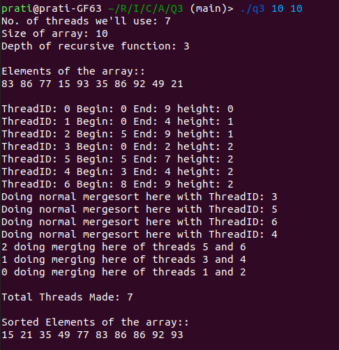

## Problem 1

## Problem 2

## Problem 3 - Multithreaded MergeSort

According to the question, we first generated a 2GB file of space-separated, random ASCII characters to act as our input file, which was then sorted using the program (q3.cpp) on the basis of the ASCII values. The output was then written into the file outputFile.txt.

We implemented merge sort algorithm, using multithreads to speed it up.

### Algorithm
The standard merge sort algorithm divides the input array into two halves, calls itself for the two halves and then merges the two sorted halves. 

Now, for multithreaded mergesort, we are recursively creating two threads (left and right portion) for doing the mergesort function, and then, aftering "joining" them, we are calling the merge function.

Essentially, the parent thread makes 2 child threads (to do mergesort), and then merges the two sorted arrays. 

We can visualize this as "levels" or "depth" of recursive function. Once the maximum depth (calculated on the number of threads we can use) is reached, that thread does the standard mergesort for that portion of the array.

Using the example, where we have set the number of threads to be (6 + parent):

T0 is the parent thread, which generates Level 1 threads (T1 and T2) for left and right parts of the array. They, in turn, generate Level 2 (T3, T4 T5 and T6), which perform normal mergesort (no threads generated for Level 3). Then, level 1 threads merge the Level 2 threads, which in turn are merged by T0 (parent thread).

Output of our program:

### Implementation
Let us say our array is of n characters, and we are allowed to use a maximum of t threads. As per our algorithm, we would be using (1+2+4+8+..) number of threads in total. This forms a geometric sequence, whose sum is 2^h -1. Now, we need to find the greatest (2^h - 1), less than t. This is done in heightOfFunc() and roundNumberOfThreads().

Now, here, h is an important number as it tells us the depth of the recursion, and that forms the "stopping criteria" of the recursion, i.e. when the maximum depth is reached, it won't create more threads, and rather, just do normal mergesort.

For the purpose of ID'ing threads, we are using a counter, whose control is mainatained by a lock. It is only changed once throughout the running of a thread (when updating twice, we found it created undefined behaviour, and deadlocks occured).

### Benchmarks

