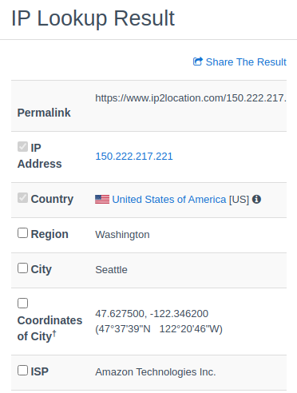

## Problem 1

### 1A
Using ifconfig, the laptop gave the output of `172.16.21.161`
On using iplocation.com, the IP address shown was `14.139.34.5`.
These values are different. `172.16.21.161` is our Private IP Address. which is used to communicate within the network, and is use dto load the network. It has a local scope.

On the other hand, `14.139.34.5` is our Public IP Address which is used to communicate outside the network. It is used for accessing the internet.

Similarly, results for each of the team members:
Pratiksha:
 

Solai Adithya:
 

Ayuj:
 

Manan:
 

Niveditha:
 

Harnanman:
 

### 1B

We traced `www.amazon.com`
Observations:
 
Location of ip Addresses
 
 
 
 
 
 
 
 
 

### 1C
We set up remote server and satrted jupyter notebook:
 
After that, we did port forwarding from the remote using the `ssh` command:
 
After that, on the "local" or different laptop, we looked at port:4321 and started the notebook - whose result is shown.
 

## Problem 2

## Problem 3 
